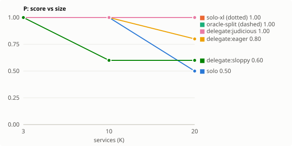
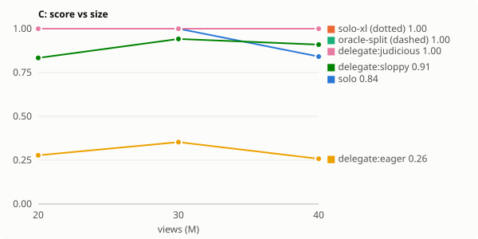
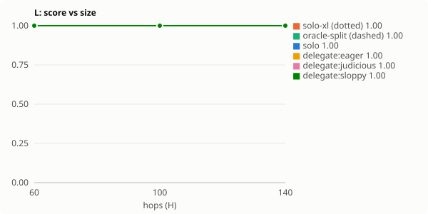

# Orchestrator track: rehearsal in Docker under Harbor

## Headline

Capture = share of the oracle-split ceiling's gain over solo that delegating recovered (0 = no better than solo, 1 = matches the scripted ideal). Harm = mean score lost against solo on delegation-favourable tasks (catches damage capture cannot see where solo already scores at the ceiling). Tax = score lost by delegating where the ideal policy is solo (L). Cost ratio = total tokens vs solo on those tasks.

| system | condition | capture | harm | lift W/P/C | structural lift | headroom | tax L | cost ratio L | decision acc. | coverage | duplication | synthesis loss | tokens/run |
|---|---|---|---|---|---|---|---|---|---|---|---|---|---|
| harbor-rehearsal | delegate:eager | 0.52 | 0.22 | -0.03 | -0.27 | 0.27 | +0.00 | 0.31× | 0.50 | 0.93 | 0.00 | 0.00 | 222.8k |
| harbor-rehearsal | delegate:judicious | 1.00 | 0.00 | +0.24 | +0.00 | 0.00 | +0.00 | 1.04× | 1.00 | 1.00 | 0.00 | 0.00 | 451.7k |
| harbor-rehearsal | delegate:sloppy | -0.10 | 0.15 | -0.11 | -0.35 | 0.36 | +0.00 | 1.04× | 1.00 | 0.87 | 0.20 | 0.50 | 538.0k |

## Scaling: harbor-rehearsal

### W — wide sweep (tickets)

| condition | size 60 | size 96 | size 128 | tokens (largest) | lead exit, largest size |
|---|---|---|---|---|---|
| solo | 0.61 | 0.51 | 0.40 | 551.9k | ContextExceeded |
| solo-xl | 0.99 | 0.99 | 0.99 | 10136.6k | Submitted |
| oracle-split | 1.00 | 1.00 | 1.00 | 961.6k | Submitted |
| delegate:eager | 1.00 | 1.00 | 0.84 | 440.4k | Submitted |
| delegate:judicious | 1.00 | 1.00 | 1.00 | 979.2k | Submitted |
| delegate:sloppy | 0.57 | 0.59 | 0.59 | 1288.7k | Submitted |

### P — parallel probes (services)

| condition | size 15 | size 25 | size 38 | tokens (largest) | lead exit, largest size |
|---|---|---|---|---|---|
| solo | 1.00 | 0.88 | 0.58 | 1364.5k | ContextExceeded |
| solo-xl | 1.00 | 1.00 | 1.00 | 4383.7k | Submitted |
| oracle-split | 1.00 | 1.00 | 1.00 | 265.6k | Submitted |
| delegate:eager | 1.00 | 1.00 | 0.84 | 191.7k | Submitted |
| delegate:judicious | 1.00 | 1.00 | 1.00 | 283.2k | Submitted |
| delegate:sloppy | 0.40 | 0.48 | 0.47 | 368.9k | Submitted |

### C — coupled views (views)

| condition | size 20 | size 30 | size 40 | tokens (largest) | lead exit, largest size |
|---|---|---|---|---|---|
| solo | 1.00 | 1.00 | 0.84 | 1679.2k | ContextExceeded |
| solo-xl | 1.00 | 1.00 | 1.00 | 2466.2k | Submitted |
| oracle-split | 1.00 | 1.00 | 1.00 | 311.2k | Submitted |
| delegate:eager | 0.28 | 0.35 | 0.26 | 212.6k | Submitted |
| delegate:judicious | 1.00 | 1.00 | 1.00 | 326.1k | Submitted |
| delegate:sloppy | 0.83 | 0.94 | 0.91 | 382.6k | Submitted |

### L — ledger chain (hops)

| condition | size 60 | size 100 | size 140 | tokens (largest) | lead exit, largest size |
|---|---|---|---|---|---|
| solo | 1.00 | 1.00 | 1.00 | 1060.6k | Submitted |
| solo-xl | 1.00 | 1.00 | 1.00 | 1066.4k | Submitted |
| oracle-split | 1.00 | 1.00 | 1.00 | 1060.6k | Submitted |
| delegate:eager | 1.00 | 1.00 | 1.00 | 286.4k | Submitted |
| delegate:judicious | 1.00 | 1.00 | 1.00 | 1091.1k | Submitted |
| delegate:sloppy | 1.00 | 1.00 | 1.00 | 1091.1k | Submitted |

## Reading this

- **Lift** = delegate − solo. **Structural lift** = delegate − solo-xl, the compute-matched control: positive means delegation bought more than tokens.
- **Headroom** = oracle-split − delegate (or 1 − delegate where no oracle-split ran).
- **Coverage / duplication** are measured against each task's work items as named in briefs. **Synthesis loss** is the share of correct worker findings the final answer lost.
- Differences between single runs are not findings. Report seeds and treat gaps smaller than the seed-to-seed spread as ties.
