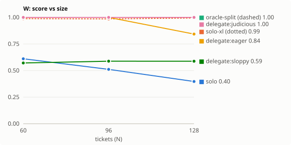

# Orchestrator track: rehearsal

**A rehearsal, not a measurement.** Every agent here is a scripted *perfect reader*:
it knows the right answer for any ticket or service it has actually read. Reading
skill is held perfect so that differences come only from structure: who hits a
wall, how work is partitioned, and what survives synthesis. That is what the
metrics claim to measure, and this checks that they separate policies the way they
should. It says nothing about any real model.

Expect solo-xl to match delegate here. A perfect reader suffers no context rot, so
more tokens are as good as more agents. The live run exists to test whether that
holds for a real model.

## Headline

Capture = share of the oracle-split ceiling's gain over solo that delegating recovered (0 = no better than solo, 1 = matches the scripted ideal). Harm = mean score lost against solo on delegation-favourable tasks (catches damage capture cannot see where solo already scores at the ceiling). Tax = score lost by delegating where the ideal policy is solo (L). Cost ratio = total tokens vs solo on those tasks.

| system | condition | capture | harm | lift W/P/C | structural lift | headroom | tax L | cost ratio L | decision acc. | coverage | duplication | synthesis loss | tokens/run |
|---|---|---|---|---|---|---|---|---|---|---|---|---|---|
| rehearsal | delegate:eager | 0.52 | 0.22 | -0.03 | -0.27 | 0.27 | +0.00 | 0.31× | 0.50 | 0.93 | 0.00 | 0.00 | 223.1k |
| rehearsal | delegate:judicious | 1.00 | 0.00 | +0.24 | +0.00 | 0.00 | +0.00 | 1.04× | 1.00 | 1.00 | 0.00 | 0.00 | 452.4k |
| rehearsal | delegate:sloppy | -0.10 | 0.15 | -0.11 | -0.35 | 0.36 | +0.00 | 1.04× | 1.00 | 0.87 | 0.20 | 0.50 | 538.8k |

## Scaling: rehearsal

### W — wide sweep (tickets)

| condition | size 60 | size 96 | size 128 | tokens (largest) | lead exit, largest size |
|---|---|---|---|---|---|
| solo | 0.61 | 0.51 | 0.40 | 552.0k | ContextExceeded |
| solo-xl | 0.99 | 0.99 | 0.99 | 10138.4k | Submitted |
| oracle-split | 1.00 | 1.00 | 1.00 | 961.8k | Submitted |
| delegate:eager | 1.00 | 1.00 | 0.84 | 440.5k | Submitted |
| delegate:judicious | 1.00 | 1.00 | 1.00 | 979.5k | Submitted |
| delegate:sloppy | 0.57 | 0.59 | 0.59 | 1288.9k | Submitted |

### P — parallel probes (services)

| condition | size 15 | size 25 | size 38 | tokens (largest) | lead exit, largest size |
|---|---|---|---|---|---|
| solo | 1.00 | 0.88 | 0.58 | 1365.8k | ContextExceeded |
| solo-xl | 1.00 | 1.00 | 1.00 | 4388.6k | Submitted |
| oracle-split | 1.00 | 1.00 | 1.00 | 265.9k | Submitted |
| delegate:eager | 1.00 | 1.00 | 0.84 | 191.9k | Submitted |
| delegate:judicious | 1.00 | 1.00 | 1.00 | 283.5k | Submitted |
| delegate:sloppy | 0.40 | 0.48 | 0.47 | 369.3k | Submitted |

### C — coupled views (views)

| condition | size 20 | size 30 | size 40 | tokens (largest) | lead exit, largest size |
|---|---|---|---|---|---|
| solo | 1.00 | 1.00 | 0.84 | 1680.4k | ContextExceeded |
| solo-xl | 1.00 | 1.00 | 1.00 | 2467.2k | Submitted |
| oracle-split | 1.00 | 1.00 | 1.00 | 311.7k | Submitted |
| delegate:eager | 0.28 | 0.35 | 0.26 | 213.0k | Submitted |
| delegate:judicious | 1.00 | 1.00 | 1.00 | 326.7k | Submitted |
| delegate:sloppy | 0.83 | 0.94 | 0.91 | 383.0k | Submitted |

### L — ledger chain (hops)

| condition | size 60 | size 100 | size 140 | tokens (largest) | lead exit, largest size |
|---|---|---|---|---|---|
| solo | 1.00 | 1.00 | 1.00 | 1064.5k | Submitted |
| solo-xl | 1.00 | 1.00 | 1.00 | 1068.9k | Submitted |
| oracle-split | 1.00 | 1.00 | 1.00 | 1064.5k | Submitted |
| delegate:eager | 1.00 | 1.00 | 1.00 | 287.3k | Submitted |
| delegate:judicious | 1.00 | 1.00 | 1.00 | 1095.0k | Submitted |
| delegate:sloppy | 1.00 | 1.00 | 1.00 | 1095.0k | Submitted |

## Reading this

- **Lift** = delegate − solo. **Structural lift** = delegate − solo-xl, the compute-matched control: positive means delegation bought more than tokens.
- **Headroom** = oracle-split − delegate (or 1 − delegate where no oracle-split ran).
- **Coverage / duplication** are measured against each task's work items as named in briefs. **Synthesis loss** is the share of correct worker findings the final answer lost.
- Differences between single runs are not findings. Report seeds and treat gaps smaller than the seed-to-seed spread as ties.
